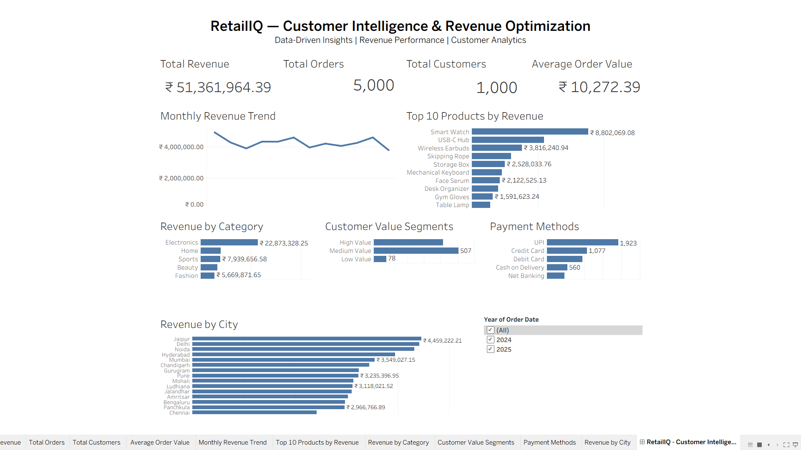

# RetailIQ — Customer Intelligence & Revenue Optimization

> An end-to-end retail analytics project using **MySQL, SQL, and Tableau** to uncover insights into revenue, customer behavior, product performance, sales trends, payment methods, and geographic performance.

---

## 📌 Project Overview

**RetailIQ** is a retail data analytics project designed to transform transactional data into meaningful and actionable business insights.

The project combines **MySQL and SQL** for data storage and analysis with **Tableau** for interactive data visualization and dashboard development.

The analysis provides insights into:

- 💰 Revenue and sales performance
- 🛒 Order activity
- 👥 Customer behavior and value segments
- 🏆 Product performance
- 📊 Category-wise revenue
- 📈 Monthly revenue trends
- 💳 Payment method preferences
- 📍 City-wise revenue performance

The primary goal of RetailIQ is to support **data-driven business decisions** related to sales, marketing, inventory planning, and customer retention.

---

## 🎯 Project Objectives

The key objectives of this project are to:

1. Analyze overall revenue and order performance.
2. Identify the highest-performing products.
3. Compare revenue across different product categories.
4. Segment customers based on their value.
5. Analyze monthly revenue trends.
6. Understand customer payment preferences.
7. Compare revenue performance across different cities.
8. Develop an interactive Tableau dashboard.
9. Generate actionable business insights from retail data.

---

## 🛠️ Tools & Technologies

| Tool / Technology | Purpose |
|---|---|
| **MySQL** | Database management and data storage |
| **SQL** | Data querying, joins, aggregation, filtering, and analysis |
| **Tableau** | Interactive dashboards and data visualization |
| **Excel / CSV** | Data preparation and source data |
| **GitHub** | Project documentation and version control |

---

## 🗂️ Project Structure

RetailIQ/
│
├── data/
│   └── retail_data.csv
│
├── sql/
│   ├── database_setup.sql
│   └── analysis_queries.sql
│
├── tableau/
│   └── RetailIQ_Dashboard.twbx
│
├── screenshots/
│   └── retailiq_dashboard.png
│
└── README.md

---

## 📊 Tableau Dashboard

The RetailIQ dashboard provides an interactive view of key retail business metrics and performance indicators.

### Dashboard Components

- 💰 Total Revenue
- 🛒 Total Orders
- 👥 Total Customers
- 💵 Average Order Value
- 📈 Monthly Revenue Trend
- 🏆 Top 10 Products by Revenue
- 🏷️ Revenue by Category
- 👤 Customer Value Segments
- 💳 Payment Methods
- 📍 Revenue by City
- 📅 Year Filter

---

## 🖼️ Dashboard Preview



---

## 💡 Key Business Insights

### 1. Electronics is the leading revenue category

Electronics generated approximately **₹22.87 million**, making it the strongest revenue-generating category.

### 2. Smart Watch is the top-performing product

The **Smart Watch** generated approximately **₹8.80 million**, making it the highest-revenue product among the Top 10 products.

### 3. Strong customer value distribution

| Customer Segment | Customers |
|---|---:|
| High Value | 415 |
| Medium Value | 507 |
| Low Value | 78 |

The large Medium Value segment represents an opportunity to increase customer spending through targeted offers and loyalty strategies.

### 4. UPI is the most-used payment method

UPI accounts for approximately **1,923 orders**, making it the most frequently used payment method in the dashboard.

### 5. Geographic performance varies

Jaipur is the highest-revenue city shown in the dashboard, generating approximately **₹4.46 million**.

### 6. Monthly revenue shows consistent performance

The monthly revenue trend remains broadly stable while showing fluctuations between individual months.

---

## 💼 Business Recommendations

- Prioritize high-revenue products for inventory planning.
- Focus marketing efforts on high-performing categories.
- Develop targeted campaigns for Medium Value customers.
- Continue optimizing digital payment experiences.
- Analyze high-performing cities to identify successful strategies.
- Use monthly trends to improve promotional and inventory planning.

---

## 🧮 Example SQL Query

```sql
SELECT
    p.product_name,
    SUM(oi.quantity * p.price) AS total_revenue
FROM Order_Items oi
JOIN Products p
    ON oi.product_id = p.product_id
GROUP BY p.product_name
ORDER BY total_revenue DESC
LIMIT 10;
